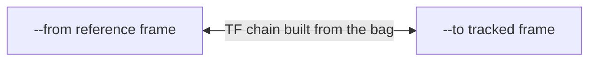
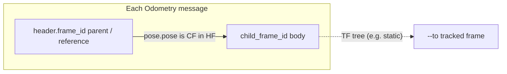
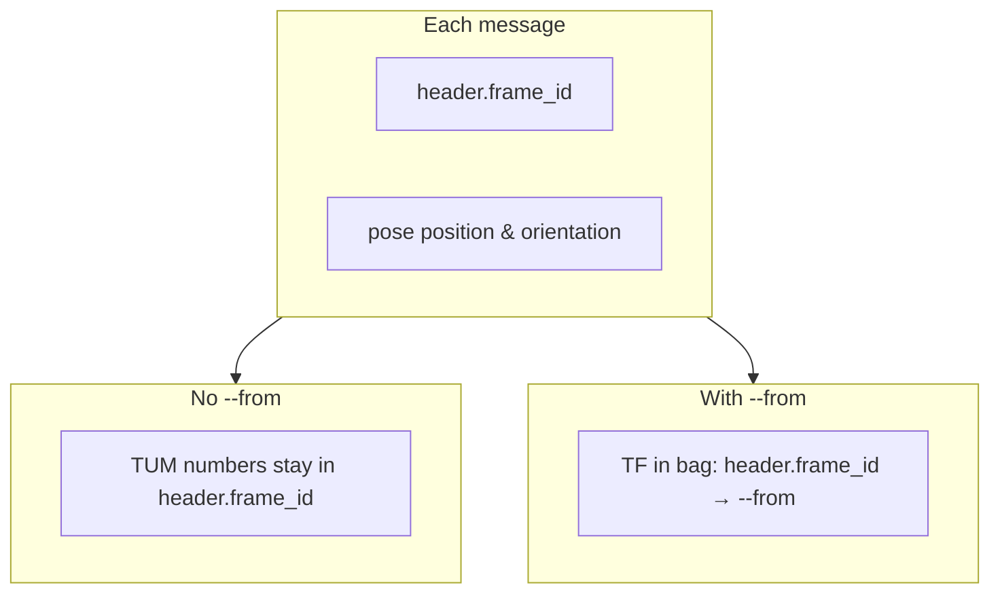

# `bagwiz traj`

Trajectory-shaped operations on a ROS 2 rosbag. Subcommands:

| Subcommand                  | Purpose                                                         |
| --------------------------- | --------------------------------------------------------------- |
| [`dump`](#bagwiz-traj-dump) | Dump a sampled trajectory to a TUM file from a supported topic. |
| [`join`](#bagwiz-traj-join) | Embed a trajectory file into a bag as a new TF message topic.   |

ROS 1 `*.bag` inputs are not supported.

---

## `bagwiz traj dump`

Samples poses from one bag topic and writes TUM. **Every output row is the pose
of the tracked frame `--to` expressed in the reference frame `--from`** — the
same convention as `lookupTransform(--from, --to, t)`. The result is composed
from the message's own pose and the bag's TF tree (static + dynamic), so a
rigid-body offset such as `base_link → sensor` from `*tf_static` is applied
automatically. Supported message types:

| Message type                                  | `--from`                                | `--to`                                                                              |
| --------------------------------------------- | --------------------------------------- | ----------------------------------------------------------------------------------- |
| `tf2_msgs/msg/TFMessage`                      | **Required** — reference frame          | **Required** — tracked frame                                                        |
| `nav_msgs/msg/Odometry`                       | Optional, defaults to `header.frame_id` | Optional, defaults to `child_frame_id`; a different value traverses the TF tree     |
| `geometry_msgs/msg/PoseStamped`               | Optional, defaults to `header.frame_id` | Optional — the body frame the pose reports (does not change the numbers; see below) |
| `geometry_msgs/msg/PoseWithCovarianceStamped` | Optional, defaults to `header.frame_id` | Optional — same as `PoseStamped`                                                    |

The composition applied to every row is:

```text
T_from_to = T_from_header * T_header_body * T_body_to
```

- `T_header_body` is the message's own pose — the tracked body expressed in its
  `header.frame_id`.
- `T_from_header` re-expresses the result into `--from` via the TF tree
  (`lookupTransform(--from, header.frame_id, t)`); identity when `--from` is
  omitted or already equals `header.frame_id`.
- `T_body_to` walks from the body frame to `--to` via the TF tree
  (`lookupTransform(body, --to, t)`); identity when no tracked-side traversal
  is needed.

Twist and covariance are never written to TUM.

### Frames and options (`--from` / `--to`)

#### TF auto-resolution (applies to every topic type below)

All TF lookups are resolved against a single TF buffer built from **every**
`tf2_msgs/msg/TFMessage` topic in the bag (dynamic `/tf` and any topic whose
name ends with `tf_static` are merged automatically; static topics are inserted
as static transforms, the rest as dynamic). The message poses themselves are
**not** inserted into this buffer — they are composed with it — so the input
topic never conflicts with or re-parents the bag's existing TF tree.

Multi-hop paths through the TF tree are fine: the requested frames do **not**
need to be directly connected by a single TF edge. The only requirement is that
some TF path linking them exists in the bag at the relevant time. For example, a
chain like `map → odom → base_link → sensor` is resolved transparently when you
ask for `--from map --to sensor`.

#### Quick mental model

- **`--from`** — the reference frame the trajectory is expressed in. Required
  for TF topics; optional for pose / odometry, where it defaults to each
  message's `header.frame_id` (no remap).
- **`--to`** — the tracked frame whose trajectory you want. Required for TF
  topics. For odometry it defaults to `child_frame_id`; a different value
  traverses the TF tree from the body to `--to`. For pose topics it names the
  body the pose reports (see the pose subsection for why this does not change
  the numbers).

#### TF topic (`tf2_msgs/msg/TFMessage`)

Both `--from` and `--to` are **required**. All `TFMessage` topics in the bag are
loaded into one buffer; sample times come from the chosen `<topic>` (typically
dynamic `/tf`). Each output row is the result of `lookupTransform(--from, --to,
t)` at that time: the pose of frame `--to` expressed in frame `--from`.



```text
TUM row at time t  ≍  pose of `--to`  expressed in  `--from`
                   (same convention as lookupTransform(--from, --to, t))
```

#### Odometry (`nav_msgs/msg/Odometry`)

The pose is **of `child_frame_id`** expressed **in `header.frame_id`** (the
usual TF parent/reference vs child/body intuition). Each sample uses `pose.pose`
(twist is ignored). Every message must have non-empty `header.frame_id` and
`child_frame_id`; if any decoded message has either empty, the command exits
with an error.

- **`--from`** (optional, default `header.frame_id`): re-express the pose into
  this frame via the TF tree.
- **`--to`** (optional, default `child_frame_id`): the tracked frame. When it
  equals `child_frame_id` the body pose is used directly; when it differs, the
  TF tree is walked from `child_frame_id` to `--to` (for example the static
  `base_link → tamagawa/imu_link` edge), so the row becomes the pose of the
  sensor rather than the vehicle body.



```text
--from map --to tamagawa/imu_link
  →  T_map_imu = T_map_base_link (odom pose) * T_base_link_imu (static TF)
```

#### Pose topics (`PoseStamped`, `PoseWithCovarianceStamped`)

Each message carries **one** pose, expressed in its `header.frame_id`. There is
no `child_frame_id` field, so the pose already encodes its own body frame.
Every message must have a non-empty `header.frame_id`; if any decoded message
has an empty `header.frame_id`, the command exits with an error.

- **`--from`** (optional, default `header.frame_id`): re-express each pose into
  this frame via the TF tree.
- **`--to`** (optional): names the body frame the pose reports. Because the pose
  already encodes its body, `--to` is informational and **does not change the
  written numbers** — and it never traverses further. For tracked-side TF
  traversal (e.g. body → sensor), use an `Odometry` topic, which carries
  `child_frame_id`, or `/tf` directly.



#### Options cheat sheet

| Topic type         | `--from`                                        | `--to`                                                           |
| ------------------ | ----------------------------------------------- | ---------------------------------------------------------------- |
| `TFMessage`        | Required: reference frame                       | Required: tracked frame                                          |
| `Odometry`         | Optional (default `header.frame_id`): ref frame | Optional (default `child_frame_id`): tracked frame, traverses TF |
| Pose (Stamped/PWC) | Optional (default `header.frame_id`): ref frame | Optional: asserted body frame (informational, no numeric change) |

### Usage

```text
bagwiz traj dump [OPTIONS] <input> <topic> <output>
```

### Positional arguments

| Name     | Description                                                                                                                                                        |
| -------- | ------------------------------------------------------------------------------------------------------------------------------------------------------------------ |
| `input`  | ROS 2 rosbag path (rosbag2 directory, `*.mcap`, `*.db3`, `*.db3.zstd`).                                                                                            |
| `topic`  | Topic whose type selects processing (`TFMessage`, `PoseStamped`, `PoseWithCovarianceStamped`, or `Odometry`).                                                      |
| `output` | Output file path. Pre-existing files stop the run unless `-w`/`--overwrite` is passed. With no `-f/--format`, the extension must be recognized (currently `.tum`). |

### Options

| Flag                 | Default      | Description                                                                                                                                                                                                                                                                       |
| -------------------- | ------------ | --------------------------------------------------------------------------------------------------------------------------------------------------------------------------------------------------------------------------------------------------------------------------------- |
| `--from <FRAME>`     | _(optional)_ | Reference frame the trajectory is expressed in. Required for TF topics. For pose / odometry it defaults to each message's `header.frame_id` (no remap); set it to re-express via the TF tree.                                                                                     |
| `--to <FRAME>`       | _(optional)_ | Tracked frame whose trajectory is written. Required for TF topics. Odometry: defaults to `child_frame_id`; a different value traverses the TF tree (e.g. static `base_link → sensor`). Pose topics: names the body the pose reports (informational, does not change the numbers). |
| `-f`, `--format <F>` | _(empty)_    | Output format id (`tum`). When omitted, the format is inferred from the output path extension (for example `*.tum` → `tum`). If you pass `-f`, it overrides the extension.                                                                                                        |
| `-w`, `--overwrite`  | `false`      | Replace `<output>` if it already exists. Without this flag, an existing output path stops the run.                                                                                                                                                                                |

### TF topic: how sampling works

1. The bag is scanned once. Every `tf2_msgs/msg/TFMessage` topic is loaded into
   a single TF buffer; topics whose name ends with `tf_static` are inserted as
   static transforms, the rest as dynamic.
2. The chain `--from → … → --to` is resolved against the buffer (a stable
   topology is assumed; resolution happens once).
3. While reading the input topic, every `TransformStamped` whose
   `(frame_id, child_frame_id)` lies on the chain contributes its
   `header.stamp` to the sample-time set.
4. Sample times are sorted and de-duplicated.
5. For each sample time `t`, `lookupTransform(--from, --to, t)` runs against
   the buffer and the result is written to the output file.

### Pose and Odometry topics: how sampling works

1. If any TF lookup is needed (`--from` is set, or Odometry has a `--to` that
   differs from `child_frame_id`), the bag is scanned once and every
   `tf2_msgs/msg/TFMessage` topic is loaded into a single TF buffer
   (`*tf_static` as static, the rest as dynamic). A pure raw dump (no flags)
   skips this and needs no TF in the bag.
2. Messages are read from the chosen topic in bag order — one output row per
   message that decodes successfully.
3. For each message at time `t`, the output pose is composed as
   `T_from_header * T_header_body * T_body_to`, where `T_header_body` is the
   message pose and the two bridges come from the TF buffer
   (`lookupTransform(--from, header.frame_id, t)` and, for Odometry,
   `lookupTransform(child_frame_id, --to, t)`). A bridge whose endpoints
   coincide is skipped (treated as identity). A `lookupTransform` that throws
   (e.g. an unresolved frame at that time) skips that sample and is counted.

### Output: TUM format

A whitespace-separated text file, one pose per line:

```text
timestamp tx ty tz qx qy qz qw
```

`timestamp` is in seconds (with fractional nanoseconds). The file is sorted by
timestamp only when the TF path sorts sample times; pose streams follow bag
message order.

### Examples

```bash
# TF: trajectory of base_link in map, using /tf as the dynamic source.
bagwiz traj dump capture.mcap /tf traj.tum --from map --to base_link

# Odometry: vehicle body (child_frame_id) in its own header frame, as stored.
bagwiz traj dump capture.mcap /localization/kinematic_state odom.tum

# Odometry: a sensor's trajectory in map. The odom pose gives map -> base_link
# and the static base_link -> tamagawa/imu_link edge is applied automatically.
bagwiz traj dump capture.mcap /localization/kinematic_state imu.tum \
  --from map --to tamagawa/imu_link

# Pose topic: use poses as stored (reference frame is each header.frame_id).
bagwiz traj dump capture.mcap /localization/pose pose.tum

# Pose topic: express poses in map using TF from the bag.
bagwiz traj dump capture.mcap /localization/pose pose_map.tum --from map
```

### Errors

| Situation                                                                                                  | Result                                                           |
| ---------------------------------------------------------------------------------------------------------- | ---------------------------------------------------------------- |
| TF topic: `--from` or `--to` missing or empty                                                              | Error.                                                           |
| `--from` and `--to` equal (TF topics)                                                                      | Error.                                                           |
| Pose / Odometry topic: `--from` or `--to` set but empty                                                    | Error.                                                           |
| Pose topic: any message with empty `header.frame_id`                                                       | Error.                                                           |
| Odometry topic: any message with empty `header.frame_id` or `child_frame_id`                               | Error.                                                           |
| No `-f` / `--format` and output path has no extension, or extension is not recognized                      | Error (use `*.tum` or pass `-f tum`).                            |
| Topic absent / unsupported type / static TF topic given as `<topic>` for TF path                           | Error.                                                           |
| TF path: no path between `--from` and `--to`                                                               | Error.                                                           |
| TF path: path exists but no chain edge on `<topic>`                                                        | Error.                                                           |
| Pose / Odometry: a TF lookup is needed (`--from`, or Odometry `--to` ≠ child) but the bag has no TF topics | Error.                                                           |
| Some lookups fail                                                                                          | Skipped and counted; remaining poses are written if any succeed. |

### Exit status

| Code | Meaning                                               |
| ---- | ----------------------------------------------------- |
| `0`  | At least one pose was written to the output file.     |
| `1`  | Any of the error conditions above, or an I/O failure. |

---

## `bagwiz traj join`

Embed an external trajectory file into a rosbag as a new topic. The
trajectory format is selected via `-f/--format` (or inferred from the
file extension), and the destination message type is selected via
`-t/--msg-type` (currently `tf2_msgs/msg/TFMessage`). Each row in the
trajectory becomes one message, with the row's timestamp used for both
the message's receive time and the in-message `header.stamp`.

### Usage

```text
bagwiz traj join [OPTIONS] <input> <traj_file> <topic>
```

### Positional arguments

| Name        | Description                                                                                 |
| ----------- | ------------------------------------------------------------------------------------------- |
| `input`     | ROS 2 rosbag path (rosbag2 directory, `*.mcap`, `*.db3`, `*.db3.zstd`).                     |
| `traj_file` | Trajectory file. Format is selected by `-f/--format`, or inferred from the file extension.  |
| `topic`     | Topic name to publish the trajectory under. May already exist in `<input>` (see `--force`). |

### Options

| Flag                   | Default                          | Description                                                                                                                                    |
| ---------------------- | -------------------------------- | ---------------------------------------------------------------------------------------------------------------------------------------------- |
| `-o`, `--output <OUT>` | _(unset)_                        | Write the result to a new bag at `<OUT>`. When omitted, `<input>` is replaced in place via a sibling tmp directory.                            |
| `-f`, `--format <F>`   | _(empty)_                        | Trajectory format id. When omitted, inferred from the trajectory file extension. `-f` always wins over the extension when both are present.    |
| `-t`, `--msg-type <T>` | `tf`                             | ROS message type to publish under `<topic>`. Currently only `tf` (= `tf2_msgs/msg/TFMessage`) is accepted.                                     |
| `--from <FRAME>`       | _(required for `--msg-type tf`)_ | For `--msg-type tf`: parent frame id, written to `TransformStamped.header.frame_id`.                                                           |
| `--to <FRAME>`         | _(required for `--msg-type tf`)_ | For `--msg-type tf`: child frame id, written to `TransformStamped.child_frame_id`.                                                             |
| `--force`              | `false`                          | Allow overwriting an existing `<topic>` in `<input>`: existing messages are dropped from the output and replaced with the trajectory.          |
| `-w`, `--overwrite`    | `false`                          | Replace `-o/--output` if it already exists. Has no effect in in-place mode (when `-o` is omitted, `<input>` is replaced atomically by design). |

### Behavior

1. The trajectory is read into memory using the resolved format's
   parser. Parsers preserve the original nanosecond timestamps without
   going through a `double` where possible, so year-2026-magnitude
   stamps round-trip bit-exactly.
2. Each row becomes a `TransformStamped` with `header.stamp` set from
   the row's timestamp, `header.frame_id = --from`, and
   `child_frame_id = --to`.
3. The destination bag's topic list and per-topic message counts are
   inspected. The result is one of:
   - `<topic>` is absent → declared new with a freshly-built schema for
     `tf2_msgs/msg/TFMessage`.
   - `<topic>` exists and has zero messages → its declaration is kept
     and the trajectory is appended.
   - `<topic>` exists with messages and `--force` is **unset** → the
     command aborts with a message asking for `--force`.
   - `<topic>` exists with messages and `--force` is **set** → existing
     payloads are dropped during stream-copy and replaced with the
     trajectory.
   - `<topic>` exists with a different message type → error (cannot be
     overridden with `--force`).
4. The output bag is written through the same writer used by
   `bagwiz convert`. Every other topic from `<input>` is copied
   through unchanged (timestamp and payload preserved).
5. With `-o`, the output lands at the explicit path. Without `-o`,
   a sibling tmp path is built, populated, and then atomically swapped
   into the input's location (`remove_all` + `rename`). A process
   crash between the two filesystem operations would leave the input
   missing — use `-o` when that is not acceptable.

### Examples

```bash
# Replace input.mcap in place: embed traj.tum on /trajectory/tf
# (map → base_link).
bagwiz traj join input.mcap traj.tum /trajectory/tf \
  --from map --to base_link

# Same content, but write to a new bag instead of replacing the input.
bagwiz traj join input.mcap traj.tum /trajectory/tf \
  --from map --to base_link -o output.mcap

# Force overwrite when /trajectory/tf already carries messages.
bagwiz traj join input.mcap traj.tum /trajectory/tf \
  --from map --to base_link --force
```

### Errors

| Situation                                                      | Result                                |
| -------------------------------------------------------------- | ------------------------------------- |
| `--msg-type tf` but `--from` or `--to` missing / empty / equal | Error.                                |
| `-f` set to an unsupported format id                           | Error.                                |
| No `-f` and the trajectory file has no recognised extension    | Error.                                |
| Trajectory file has no valid rows for the resolved format      | Error.                                |
| `<topic>` exists in `<input>` with another type                | Error (not relaxable with `--force`). |
| `<topic>` exists with messages and `--force` is unset          | Error.                                |
| Writer / serializer / filesystem failure                       | Error.                                |

### Exit status

| Code | Meaning                                                         |
| ---- | --------------------------------------------------------------- |
| `0`  | Output bag written with the trajectory injected on `<topic>`.   |
| `1`  | Any of the error conditions above, or an I/O failure mid-write. |
