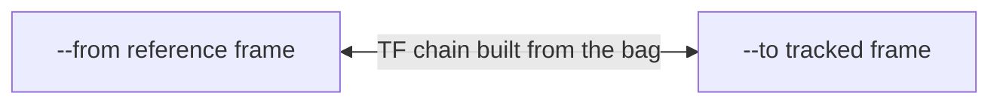
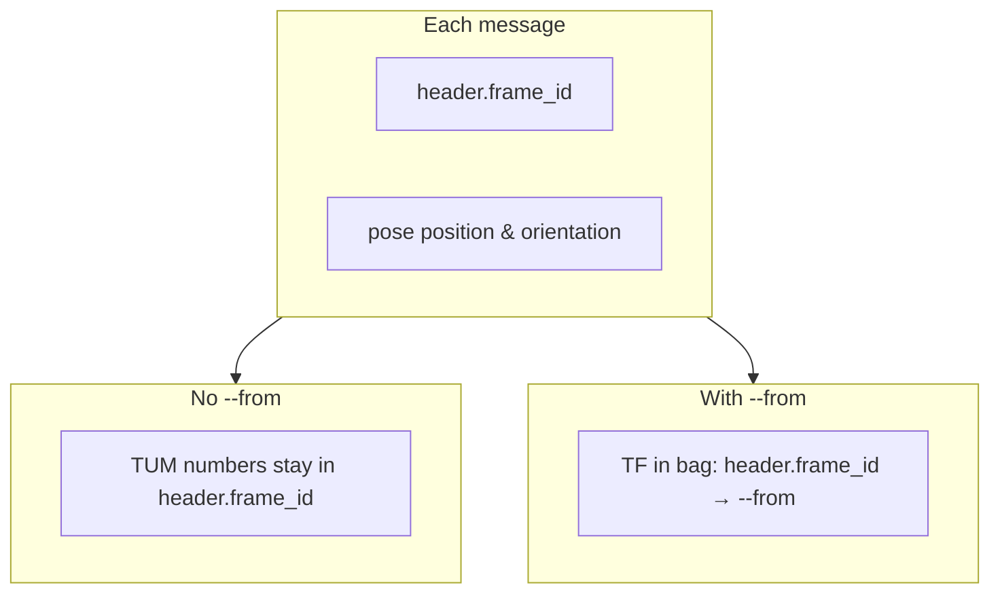
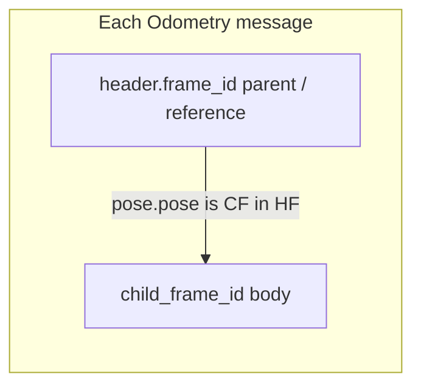

# `bagwiz traj`

Trajectory-shaped operations on a ROS 2 rosbag. Subcommands:

| Subcommand                  | Purpose                                                         |
| --------------------------- | --------------------------------------------------------------- |
| [`dump`](#bagwiz-traj-dump) | Dump a sampled trajectory to a TUM file from a supported topic. |
| [`join`](#bagwiz-traj-join) | Embed a trajectory file into a bag as a new TF message topic.   |

ROS 1 `*.bag` inputs are not supported.

---

## `bagwiz traj dump`

Samples poses from one bag topic and writes TUM. Supported message types:

| Message type                                  | `--from` | `--to`                                                                                    |
| --------------------------------------------- | -------- | ----------------------------------------------------------------------------------------- |
| `tf2_msgs/msg/TFMessage`                      | Required | Required                                                                                  |
| `geometry_msgs/msg/PoseStamped`               | Optional | Ignored if set (warning)                                                                  |
| `geometry_msgs/msg/PoseWithCovarianceStamped` | Optional | Ignored if set (warning)                                                                  |
| `nav_msgs/msg/Odometry`                       | Optional | Optional filter: when set, only messages whose `child_frame_id` equals `--to` are written |

For TF topics, output is the trajectory of frame `--to` expressed in frame
`--from`, sampled at TF updates on the chain between them that arrive on the
input topic (same behavior as before).

For `PoseStamped` and `PoseWithCovarianceStamped`, each row uses that
message’s pose. Every message must have a non-empty `header.frame_id`; if any
decoded message has an empty `header.frame_id`, the command exits with an error.

With no `--from`, values are written as they appear in the bag (the implicit
reference frame is each sample’s `header.frame_id`). With `--from <FRAME>`,
each pose is transformed from `header.frame_id` into `<FRAME>` using all
`tf2_msgs/msg/TFMessage` topics in the bag (including topics whose name ends
with `tf_static`). Covariance is not written to TUM.

If `--to` is passed for `PoseStamped` or `PoseWithCovarianceStamped`, it is
ignored and a warning is logged.

For `nav_msgs/msg/Odometry`, each sample uses `pose.pose` (twist is not written
to TUM). Every message must have non-empty `header.frame_id` and
`child_frame_id`; if any decoded message has either empty, the command exits
with an error. When `--to` is omitted, each row still represents the pose of
`child_frame_id` in `header.frame_id` (before any `--from` remap). When `--to`
is set, only messages whose `child_frame_id` equals `--to` are kept.

### Frames and options (`--from` / `--to`)

The flags are not interchangeable across topic types. See the **Options cheat
sheet** at the end of this block for a short summary, then the subsections and
diagrams for each message kind.

#### TF auto-resolution (applies to every topic type below)

All TF lookups in this command — both the `--from` → `--to` chain for TF
topics and the `header.frame_id` → `--from` remap for pose / odometry
topics — are resolved against a single TF buffer built from **every**
`tf2_msgs/msg/TFMessage` topic in the bag (dynamic `/tf` and any topic
whose name ends with `tf_static` are merged automatically; static topics
are inserted as static transforms, the rest as dynamic).

Multi-hop paths through the TF tree are fine: `--from` and `--to` (or
`header.frame_id` and `--from`) do **not** need to be directly connected
by a single TF edge. The only requirement is that some TF path linking
them exists in the bag at the relevant time. For example, a chain like
`map → odom → base_link → sensor` is resolved transparently when you ask
for `--from map --to sensor`.

#### Quick mental model

- **`--from`**: For TF topics, the **reference frame** used in
  `lookupTransform(--from, --to, t)`. For pose and odometry topics, the **output
  reference frame** when you ask for a TF remap; if you omit it, numeric values
  stay expressed in each message’s `header.frame_id`.
- **`--to`**: For TF topics, the **tracked frame** whose trajectory you want. For
  pure pose topics, **unused** (warning if set). For odometry, an optional
  **filter on `child_frame_id`** (not a TF lookup).

#### TF topic (`tf2_msgs/msg/TFMessage`)

Both `--from` and `--to` are **required**. All `TFMessage` topics in the bag are
loaded into one buffer; sample times come from the chosen `<topic>` (typically
dynamic `/tf`). Each output row is the result of `lookupTransform(--from, --to,
t)` at that time: the pose of frame `--to` expressed in frame `--from`.



```text
TUM row at time t  ≍  pose of `--to`  expressed in  `--from`
                   (same convention as lookupTransform(--from, --to, t))
```

#### Pose topics (`PoseStamped`, `PoseWithCovarianceStamped`)

Each message carries **one** pose. Its reference frame is **`header.frame_id`**.
There is no separate child-frame field, so **`--to` is ignored** (a warning is
logged if you set it).



#### Odometry (`nav_msgs/msg/Odometry`)

The pose is **of `child_frame_id`** expressed **in `header.frame_id`**. That
matches the usual TF intuition (parent / reference vs child / body).

- **`--from`** (optional): same TF remap as pose topics: express the pose in
  `--from` instead of `header.frame_id`.
- **`--to`** (optional): if set, **keep only** messages whose `child_frame_id`
  string equals `--to`. If omitted, no filtering; each row still describes the
  pose of this message’s `child_frame_id`.



```text
Optional filter:  --to base_link   →   keep messages with child_frame_id == base_link
Optional remap:    --from map      →   rewrite pose into map using TF from the bag
```

#### Options cheat sheet

| Topic type         | `--from`                         | `--to`                                      |
| ------------------ | -------------------------------- | ------------------------------------------- |
| `TFMessage`        | Required: output reference frame | Required: tracked frame for the trajectory  |
| Pose (Stamped/PWC) | Optional: TF remap target        | Ignored (warning)                           |
| `Odometry`         | Optional: TF remap target        | Optional: filter by `child_frame_id` string |

### Usage

```text
bagwiz traj dump [OPTIONS] <input> <topic> <output>
```

### Positional arguments

| Name     | Description                                                                                                                                                   |
| -------- | ------------------------------------------------------------------------------------------------------------------------------------------------------------- |
| `input`  | ROS 2 rosbag path (rosbag2 directory, `*.mcap`, `*.db3`).                                                                                                     |
| `topic`  | Topic whose type selects processing (`TFMessage`, `PoseStamped`, `PoseWithCovarianceStamped`, or `Odometry`).                                                 |
| `output` | Output file path. Pre-existing files stop the run unless `--overwrite` is passed. With no `-f/--format`, the extension must be recognized (currently `.tum`). |

### Options

| Flag                 | Default      | Description                                                                                                                                                                |
| -------------------- | ------------ | -------------------------------------------------------------------------------------------------------------------------------------------------------------------------- |
| `--from <FRAME>`     | _(optional)_ | TF topics: required reference frame. Pose and Odometry topics: optional; omit to keep each sample in `header.frame_id`, or set to remap into this frame via TF.            |
| `--to <FRAME>`       | _(optional)_ | TF topics: required tracked frame. Odometry: optional `child_frame_id` filter. PoseStamped / PoseWithCovarianceStamped: ignored (warning if set).                          |
| `-f`, `--format <F>` | _(empty)_    | Output format id (`tum`). When omitted, the format is inferred from the output path extension (for example `*.tum` → `tum`). If you pass `-f`, it overrides the extension. |
| `--overwrite`        | `false`      | Replace `<output>` if it already exists. Without this flag, an existing output path stops the run.                                                                         |

### TF topic: how sampling works

1. The bag is scanned once. Every `tf2_msgs/msg/TFMessage` topic is loaded into
   a single TF buffer; topics whose name ends with `tf_static` are inserted as
   static transforms, the rest as dynamic.
2. The chain `--from → … → --to` is resolved against the buffer (a stable
   topology is assumed; resolution happens once).
3. While reading the input topic, every `TransformStamped` whose
   `(frame_id, child_frame_id)` lies on the chain contributes its
   `header.stamp` to the sample-time set.
4. Sample times are sorted and de-duplicated.
5. For each sample time `t`, `lookupTransform(--from, --to, t)` runs against
   the buffer and the result is written to the output file.

### Pose and Odometry topics: how sampling works

1. Messages are read from the chosen topic in bag order (one output row per
   message that decodes successfully, subject to Odometry `--to` filtering).
2. If `--from` is set, TF messages from the same bag are merged in timestamp
   order so lookups can resolve before each pose.
3. For each pose, `lookupTransform(--from, header.frame_id, t)` supplies the
   remap when `--from` is set.

### Output: TUM format

A whitespace-separated text file, one pose per line:

```text
timestamp tx ty tz qx qy qz qw
```

`timestamp` is in seconds (with fractional nanoseconds). The file is sorted by
timestamp only when the TF path sorts sample times; pose streams follow bag
message order.

### Examples

```bash
# TF: trajectory of base_link in map, using /tf as the dynamic source.
bagwiz traj dump capture.mcap /tf traj.tum --from map --to base_link

# Pose topic: use poses as stored (reference frame is each header.frame_id).
bagwiz traj dump capture.mcap /localization/pose pose.tum

# Pose topic: express poses in map using TF from the bag.
bagwiz traj dump capture.mcap /localization/pose pose_map.tum --from map

# Odometry: only base_link messages, expressed in map via TF.
bagwiz traj dump capture.mcap /odom odom.tum --from map --to base_link
```

### Errors

| Situation                                                                             | Result                                                           |
| ------------------------------------------------------------------------------------- | ---------------------------------------------------------------- |
| TF topic: `--from` or `--to` missing or empty                                         | Error.                                                           |
| `--from` and `--to` equal (TF topics)                                                 | Error.                                                           |
| Pose / Odometry topic: `--from` set but empty                                         | Error.                                                           |
| Pose topic: any message with empty `header.frame_id`                                  | Error.                                                           |
| Odometry topic: any message with empty `header.frame_id` or `child_frame_id`          | Error.                                                           |
| No `-f` / `--format` and output path has no extension, or extension is not recognized | Error (use `*.tum` or pass `-f tum`).                            |
| Topic absent / unsupported type / static TF topic given as `<topic>` for TF path      | Error.                                                           |
| TF path: no path between `--from` and `--to`                                          | Error.                                                           |
| TF path: path exists but no chain edge on `<topic>`                                   | Error.                                                           |
| Pose remap: no TF topics in bag                                                       | Error.                                                           |
| Some lookups fail                                                                     | Skipped and counted; remaining poses are written if any succeed. |

### Exit status

| Code | Meaning                                               |
| ---- | ----------------------------------------------------- |
| `0`  | At least one pose was written to the output file.     |
| `1`  | Any of the error conditions above, or an I/O failure. |

---

## `bagwiz traj join`

Embed an external trajectory file into a rosbag as a new topic. The
trajectory format is selected via `-f/--format` (or inferred from the
file extension), and the destination message type is selected via
`-t/--msg-type` (currently `tf2_msgs/msg/TFMessage`). Each row in the
trajectory becomes one message, with the row's timestamp used for both
the message's receive time and the in-message `header.stamp`.

### Usage

```text
bagwiz traj join [OPTIONS] <input> <traj_file> <topic>
```

### Positional arguments

| Name        | Description                                                                                 |
| ----------- | ------------------------------------------------------------------------------------------- |
| `input`     | ROS 2 rosbag path (rosbag2 directory, `*.mcap`, `*.db3`).                                   |
| `traj_file` | Trajectory file. Format is selected by `-f/--format`, or inferred from the file extension.  |
| `topic`     | Topic name to publish the trajectory under. May already exist in `<input>` (see `--force`). |

### Options

| Flag                   | Default      | Description                                                                                                                                    |
| ---------------------- | ------------ | ---------------------------------------------------------------------------------------------------------------------------------------------- |
| `-o`, `--output <OUT>` | _(unset)_    | Write the result to a new bag at `<OUT>`. When omitted, `<input>` is replaced in place via a sibling tmp directory.                            |
| `-f`, `--format <F>`   | _(empty)_    | Trajectory format id. When omitted, inferred from the trajectory file extension. `-f` always wins over the extension when both are present.    |
| `-t`, `--msg-type <T>` | `tf`         | ROS message type to publish under `<topic>`. Currently only `tf` (= `tf2_msgs/msg/TFMessage`) is accepted.                                     |
| `--from <FRAME>`       | _(required)_ | For `--msg-type tf`: parent frame id, written to `TransformStamped.header.frame_id`.                                                           |
| `--to <FRAME>`         | _(required)_ | For `--msg-type tf`: child frame id, written to `TransformStamped.child_frame_id`.                                                             |
| `--force`              | `false`      | Allow overwriting an existing `<topic>` in `<input>`: existing messages are dropped from the output and replaced with the trajectory.          |
| `--overwrite`          | `false`      | Replace `-o/--output` if it already exists. Has no effect in in-place mode (when `-o` is omitted, `<input>` is replaced atomically by design). |

### Behavior

1. The trajectory is read into memory using the resolved format's
   parser. Parsers preserve the original nanosecond timestamps without
   going through a `double` where possible, so year-2026-magnitude
   stamps round-trip bit-exactly.
2. Each row becomes a `TransformStamped` with `header.stamp` set from
   the row's timestamp, `header.frame_id = --from`, and
   `child_frame_id = --to`.
3. The destination bag's topic list and per-topic message counts are
   inspected. The result is one of:
   - `<topic>` is absent → declared new with a freshly-built schema for
     `tf2_msgs/msg/TFMessage`.
   - `<topic>` exists and has zero messages → its declaration is kept
     and the trajectory is appended.
   - `<topic>` exists with messages and `--force` is **unset** → the
     command aborts with a message asking for `--force`.
   - `<topic>` exists with messages and `--force` is **set** → existing
     payloads are dropped during stream-copy and replaced with the
     trajectory.
   - `<topic>` exists with a different message type → error (cannot be
     overridden with `--force`).
4. The output bag is written through the same writer used by
   `bagwiz convert`. Every other topic from `<input>` is copied
   through unchanged (timestamp and payload preserved).
5. With `-o`, the output lands at the explicit path. Without `-o`,
   a sibling tmp path is built, populated, and then atomically swapped
   into the input's location (`remove_all` + `rename`). A process
   crash between the two filesystem operations would leave the input
   missing — use `-o` when that is not acceptable.

### Examples

```bash
# Replace input.mcap in place: embed traj.tum on /trajectory/tf
# (map → base_link).
bagwiz traj join input.mcap traj.tum /trajectory/tf \
  --from map --to base_link

# Same content, but write to a new bag instead of replacing the input.
bagwiz traj join input.mcap traj.tum /trajectory/tf \
  --from map --to base_link -o output.mcap

# Force overwrite when /trajectory/tf already carries messages.
bagwiz traj join input.mcap traj.tum /trajectory/tf \
  --from map --to base_link --force
```

### Errors

| Situation                                                      | Result                                |
| -------------------------------------------------------------- | ------------------------------------- |
| `--msg-type tf` but `--from` or `--to` missing / empty / equal | Error.                                |
| `-f` set to an unsupported format id                           | Error.                                |
| No `-f` and the trajectory file has no recognised extension    | Error.                                |
| Trajectory file has no valid rows for the resolved format      | Error.                                |
| `<topic>` exists in `<input>` with another type                | Error (not relaxable with `--force`). |
| `<topic>` exists with messages and `--force` is unset          | Error.                                |
| Writer / serializer / filesystem failure                       | Error.                                |

### Exit status

| Code | Meaning                                                         |
| ---- | --------------------------------------------------------------- |
| `0`  | Output bag written with the trajectory injected on `<topic>`.   |
| `1`  | Any of the error conditions above, or an I/O failure mid-write. |
